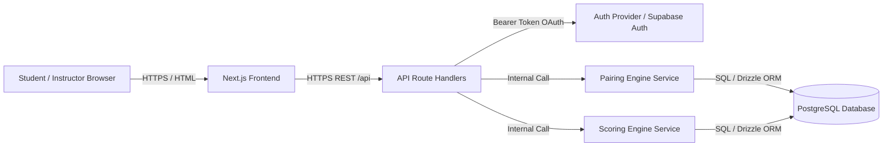

# Architecture Diagram

```mermaid
flowchart LR
    U[Student / Instructor Browser] -->|HTTPS / HTML| FE[Next.js Frontend]
    FE -->|HTTPS REST /api| API[API Route Handlers]
    API -->|Bearer Token OAuth| AUTH[Auth Provider / Supabase Auth]
    API -->|Internal Call| PAIR[Pairing Engine Service]
    API -->|Internal Call| SCORE[Scoring Engine Service]
    PAIR -->|SQL / Drizzle ORM| DB[(PostgreSQL Database)]
    SCORE -->|SQL / Drizzle ORM| DB
```

