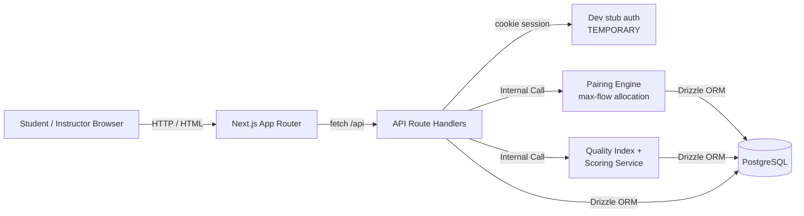

# Architecture Diagram

## Current state (M1)

- **Auth**: a dev-only cookie (`pe_uid`) set by `POST /api/auth/dev-sign-in` — see
  `src/lib/auth.ts`. Google OAuth / Better Auth (the target architecture — see
  `memory-bank/standards/tech-stack.md`) is not wired up yet; no credentials
  were available when M1 was built. `getCurrentUser()`/`getClassroomRole()`
  are the only two functions the rest of the app depends on, so swapping in
  real auth later only touches that one file.
- **Pairing Engine**: `src/services/pairing-service.ts`. Group-side only
  (individual/peer evaluation is M2). Feasibility per PRD §8.2; allocation is
  modeled as max-flow (source → evaluator capacity=quota → pair capacity=1 if
  eligible → sink capacity=coverage) rather than a plain greedy, because the
  "never evaluate your own group" exclusions make a naive per-evaluator
  greedy get stuck short of a valid balanced assignment in some group-size
  configurations.
- **Scoring**: two paths exist side by side. `src/services/scoring-service.ts`
  is the original, already-tested binary win-rate service (kept as-is, still
  used by its own tests). `src/services/quality-index.ts` implements the PRD
  §9.1 weighted 6-point table correctly (attributing points by *display
  position*, not item A/B order) and is what the real `/scores` and
  `/my-report` endpoints use, via `src/services/report-service.ts`.
- **Data**: real PostgreSQL via Drizzle (`src/db/`), not the in-memory
  `src/lib/test-data.ts` store (that stays as the stopgap backing only the
  pre-existing `/api/test/seed|cleanup` endpoints).
