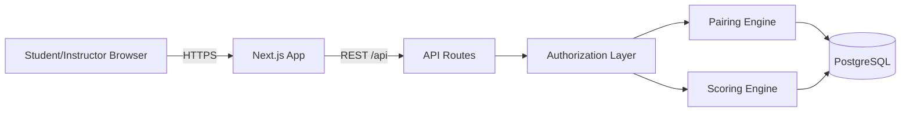

# Architecture Diagram

```mermaid
flowchart LR
    U[Student/Instructor Browser] -->|HTTPS| FE[Next.js App]
    FE -->|REST /api| API[API Routes]
    API --> AUTHZ[Authorization Layer]
    AUTHZ --> PAIR[Pairing Engine]
    AUTHZ --> SCORE[Scoring Engine]
    PAIR --> DB[(PostgreSQL)]
    SCORE --> DB
```
