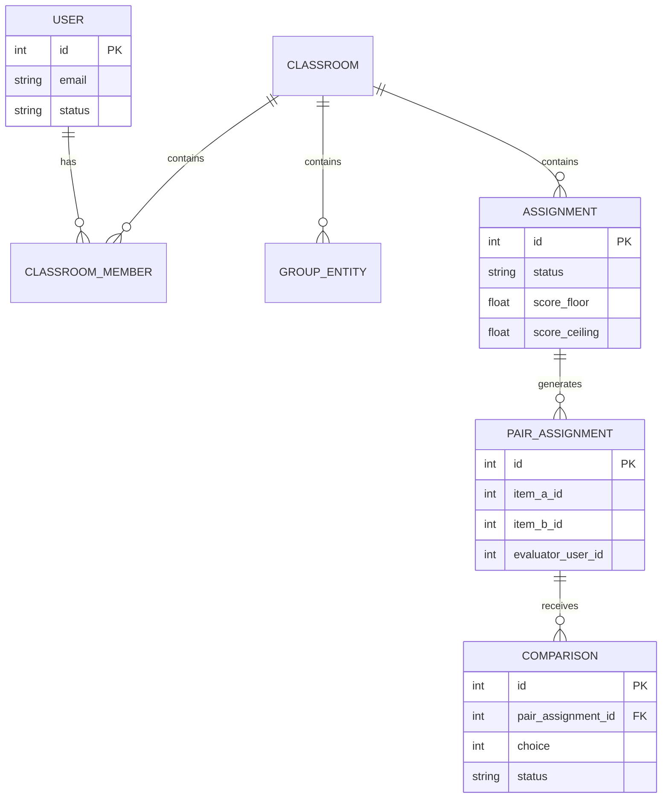

# Entity Relationship Diagram (M1 Core)

```mermaid
erDiagram
    USER ||--o{ CLASSROOM_MEMBER : has
    CLASSROOM ||--o{ CLASSROOM_MEMBER : contains
    CLASSROOM ||--o{ GROUP_ENTITY : contains
    CLASSROOM ||--o{ ASSIGNMENT : contains
    ASSIGNMENT ||--o{ PAIR_ASSIGNMENT : generates
    PAIR_ASSIGNMENT ||--o{ COMPARISON : receives

    USER {
        int id PK
        string email
        string status
    }
    ASSIGNMENT {
        int id PK
        string status
        float score_floor
        float score_ceiling
    }
    PAIR_ASSIGNMENT {
        int id PK
        int item_a_id
        int item_b_id
        int evaluator_user_id
    }
    COMPARISON {
        int id PK
        int pair_assignment_id FK
        int choice
        string status
    }
```
