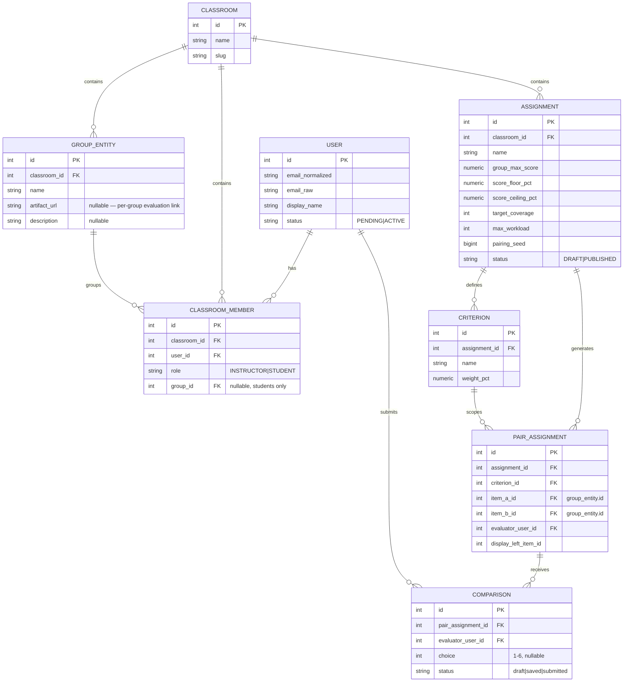

# Entity Relationship Diagram (M1)

Reflects the actual Drizzle schema in `src/db/schema.ts`. Trimmed from the
full PRD §11 data model to what M1 needs — every omission (multi-criteria
weighting beyond one auto-created criterion, `computed_score`/`score_override`/
`audit_event`/`notification`/`appeal` tables, individual-side pairing) is an
additive change for M2/M3, not a redesign.

No Docker on this dev machine, so there's no ephemeral `compose.test.yaml`
Postgres instance wired up for CI/E2E yet — local dev and the one E2E spec
(`tests/e2e/specs/m1-walking-skeleton.spec.ts`) both run against a native
Postgres install with the same credentials `compose.yaml` already documents.

## Notable adaptations vs. the full PRD §11 model

- `artifact_url`/`description` live on `group_entity`, not on `assignment` —
  the Pairwise Evaluation wireframe needs a per-group "ดูผลงาน" link, and the
  PRD's data model doesn't have an obvious home for that.
- `assignment.score_floor_pct`/`score_ceiling_pct` are 0–100 (percentage
  scale), not the PRD's 0–1 fraction, to match the existing, already-tested
  `ScoringService.calculateScore`'s validation (`floor < 0 || ceiling > 100`).
- `comparison.status` stays lowercase (`draft|saved|submitted`) to match the
  pre-existing `Comparison` TypeScript interface and its tests, rather than
  the PRD's `DRAFT|SUBMITTED|EXCLUDED`.
